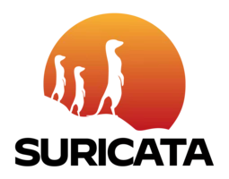
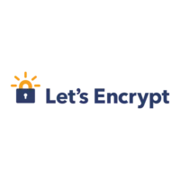

    
      
    
    
    
    
    
     
    
    
    
    
     

---

- [Description](#description)
  - [Functionalities](#functionalities)
  - [Supported Cybersecurity Solutions](#supported-cybersecurity-solutions)
- [Installation](#installation)
  - [Requirements](#requirements)
- [Demo](#demo)
- [Support](#support)
- [Contributing](#contributing)

---

# Description

**MutableSecurity** is a software product for making cybersecurity solution management easier and more accessible, from deployment and configuration to monitoring.

Despite the current lack of complex functionalities, we have a vision in mind that we hope to achieve in the near future. As we must begin somewhere, the first step in our progress is this command line interface for automatic management of cybersecurity solutions.

Come join the MutableSecurity journey!

## Functionalities

- Multiple solution supported so far (and more under development)
- Multiple authentication methods
    - Password-based for the host on which the tool is installed
    - Password-based or key-based SSH for remote hosts
- Deployments to multiple hosts with the same command
- Intuitive command line interface

## Supported Cybersecurity Solutions

<table>
    <thead>
        <tr>
            <th>Solution</th>
            <th>Short Description</th>
            <th>Others</th>
        </tr>
    </thead>
    <tbody>
        <tr>
            <td>
                
            </td>
            <td>teler is an real-time intrusion detection and threat alert based on web log. Targets only nginx installed on Ubuntu.</td>
            <td>
                
            </td>
        </tr>
        <tr>
            <td>
                
            </td>
            <td>Suricata is the leading independent open source threat detection engine. By combining intrusion detection (IDS), intrusion prevention (IPS), network security monitoring (NSM) and PCAP processing, Suricata can quickly identify, stop, and assess even the most sophisticated attacks.</td>
            <td>
                
            </td>
        </tr>
        <tr>
            <td>
                
            </td>
            <td>Let's Encrypt is a free, automated, and open certificate authority brought to you by the nonprofit Internet Security Research Group (ISRG). Certbot is a free, open source software tool for automatically using Let's Encrypt certificates on manually-administrated websites to enable HTTPS.</td>
            <td>
                
            </td>
        </tr>
        <tr>
            <td colspan=3>
More coming soon...
</td>
        </tr>
    </tbody>
</table>

# Installation

The easiest way to install MutableSecurity is from PyPI. Just run `pip install mutablesecurity` and you'll have everything set!

## Requirements

The only requirements are [Python 3.9](https://www.python.org/downloads/) and [pip](https://pip.pypa.io/en/stable/installation/).

To avoid warnings when using pip to install Python scripts, add `/home/<username>/.local/bin` (where `<username>` identifies the current user) to your `$PATH` variable.

# Demo

    

# Support

If you have any type of suggestion (for example, proposals for new functionalities or support for other security solutions), please open an issue or drop us a line at [hello@mutablesecurity.io](mailto:hello@mutablesecurity.io).

# Contributing

To find out how you can contribute to this project, check out our [contribution guide](.github/CONTRIBUTING.md).